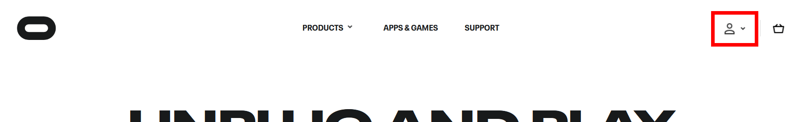
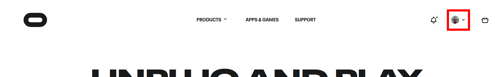
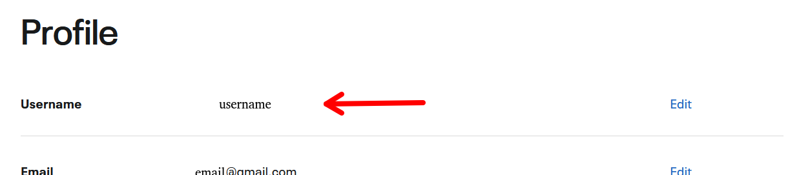
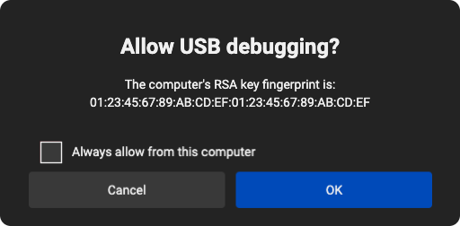

# Quest Headset Setup (Teleop)

> **Purpose / Audience**: one-time preparation of a Meta Quest headset for SODA dual-arm
> teleop, the per-session connection check, and its failure modes. For the teleop workflow
> itself (buttons, clutch, recording), see [data-collection-teleop.md](data-collection-teleop.md).

SODA drives teleop through a small headset app that streams controller poses and button
state to the robot over ADB (Android Debug Bridge). **The app ships inside the SODA
image** — on `soda teleop start` the stack installs it onto the connected headset and
launches it, automatically. There is nothing to sideload and nothing to start from inside
the headset. The only setup that exists is the one-time procedure that makes the headset
*allow* that connection.

---

## What SODA does automatically vs. what you do once

| Step | Who |
|---|---|
| Install the teleop app (`com.rail.oculus.teleop`, bundled in the image) onto the headset | SODA — checked on every `soda teleop start`, installed when missing |
| Launch the app and stream controller poses + buttons | SODA — every `soda teleop start` |
| Recover a dropped link (forces a clean clutch release so an arm never jumps on reconnect) | SODA |
| Provide ADB | SODA — `adb` ships in the image; the teleop stack drives it internally |
| Developer Mode + USB-debugging authorization on the headset | **You — one-time, below** |

---

## One-time headset preparation

> The screenshots below show the Meta (Oculus) site and headset UI as captured — Meta
> reworks these screens over time, so the highlighted entry points may have moved, but the
> steps themselves are unchanged.

### 1 · Meta account — and where to find your username

Boot the headset and complete its standard first-run setup with a Meta account. You will
need the account's **username** for the developer-organization step, so look it up now:

1. Go to the Meta (Oculus) website and log in to your account:

   

2. After logging in, open the account menu at the top right again and select **Profile**:

   

3. Your **username** is shown on the profile page:

   

### 2 · Join or create a developer organization

Meta gates Developer Mode behind a (free) developer organization. Create one for your
company at `developer.oculus.com` (Manage → Organizations → Create) with a verified
account, or have your username (step 1) added to an existing organization. Without this,
the Developer Mode toggle does not appear.

### 3 · Enable Developer Mode

In the headset's phone companion app (Meta Horizon, formerly the Oculus app):

1. Pair the headset, then open **Settings** and tap the device.
2. Go to the device's settings (**More Settings**) → **Developer Mode**.
3. Turn the **Developer Mode** toggle on, then restart the headset.

### 4 · Authorize USB debugging

Connect the headset to the robot host with a **USB-C data cable** — a charge-only cable
will not work. Put the headset on; a dialog appears:



Accept **Allow USB debugging** and tick **Always allow from this computer** so the prompt
never comes back.

### 5 · Verify

On the robot host:

```bash
adb devices
# List of devices attached
# 1WMHH123456789   device      <- serial + "device" = ready
```

If the host itself has no `adb`, run the same check through the container
(`docker exec robot-backend-1 adb devices`) or install it (`sudo apt install android-tools-adb`).

That is the whole setup. From now on the headset only needs to be plugged in.

---

## Every session

```bash
adb devices             # headset listed as "device"
soda teleop start       # installs/launches the headset app, homes the arms, opens the console
```

Keep the teleop app running in the headset's background for the whole session — do not
force-quit it. Keep both controllers inside the headset cameras' view or tracking degrades.
Buttons, clutch, and recording keys: [data-collection-teleop.md](data-collection-teleop.md).

---

## Optional: connection over Wi-Fi

USB is the supported day-to-day path; use Wi-Fi only when a cable is genuinely impossible.
The initial USB authorization (step 4) is still required once.

1. Put the headset on the **same network** as the robot host, and connect it over USB once.
2. Find the headset's IP address:

   ```bash
   adb shell ip route
   # 10.0.30.0/19 dev wlan0  proto kernel  scope link  src 10.0.32.101   <- the "src" address
   ```

3. Pass that address to the teleop launcher (`--quest-ip <headset-ip>`); the stack switches
   ADB to network mode itself.

---

## Troubleshooting

| Symptom | Likely cause | Fix |
|---|---|---|
| `adb devices` lists **nothing** | Charge-only cable, bad port, or Developer Mode off | Use a known-good **data** cable and USB port; confirm Developer Mode is on (one-time prep, above). |
| `adb devices` shows the headset as **`unauthorized`** | The USB-debugging prompt was never accepted | Put the headset on, accept **Allow USB debugging** with **Always allow** ticked, re-run `adb devices`. |
| Teleop starts but poses freeze / controllers stop responding | The headset app wedged | `adb shell am force-stop com.rail.oculus.teleop`, then `soda teleop start` again — relaunch is automatic. |
| You need a clean slate for the headset app | Corrupt install | `adb uninstall com.rail.oculus.teleop` — the next `soda teleop start` reinstalls the bundled app automatically. |
| Arms track poorly / jump between clutch presses | Controllers left the headset cameras' view | Keep the controllers in front of the headset; re-clutch to re-anchor (never jumps the arm). |

Anything else: [troubleshooting.md](troubleshooting.md).
